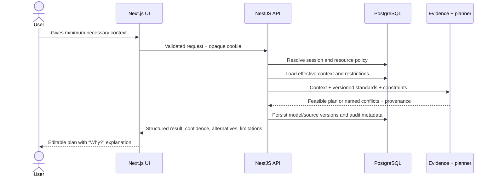

# Data flow

Sensitive response bodies are not written to application logs. Correlation IDs, duration, route, status, and coarse error codes are observable. AI context, when added, must be built after policy filtering and must exclude inaccessible household data.
