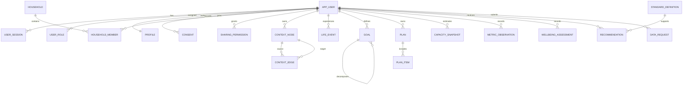

# Entity relationship overview

The migration includes foreign keys, ownership columns, privacy classes, effective dates, idempotency keys, and indexes for active sessions, graph edges, trends, plan timelines, sharing lookup, and active standards.
