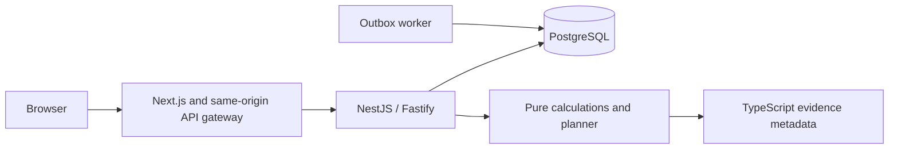

# Architecture overview

Be Human is a pnpm monorepo with a Next.js web app, NestJS/Fastify API, shared TypeScript domain package, PostgreSQL database, and separate outbox worker.

The browser holds an HttpOnly session cookie and a readable CSRF cookie. The API resolves identity, checks ownership and supported goal-view grants tied to a specific household, validates requests, and writes to PostgreSQL. The worker claims jobs from PostgreSQL with `SKIP LOCKED`. Redis and MinIO are provisioned but have no application path. The SQL evidence table and recommendation table have no publishing or consumption workflow.

Plan items are stored as `timestamptz`; the plan and user retain an IANA timezone. Today selects the user's local date. The generator takes minute offsets and caller-supplied eight-dimensional planning units. Manual plans and plans changed after generation have nullable, unknown feasibility until regenerated. The four-value Today check-in is separate and is not a validated measurement or automatic planner input.

## Trust boundaries

API input and browser state are untrusted. Authentication and authorization are server decisions. Household membership is necessary but insufficient for viewing another person's goals: a current, explicit grant is also required. Manual plan mutations have not been re-evaluated by the generator. No AI system or external integration is in the runtime path.
