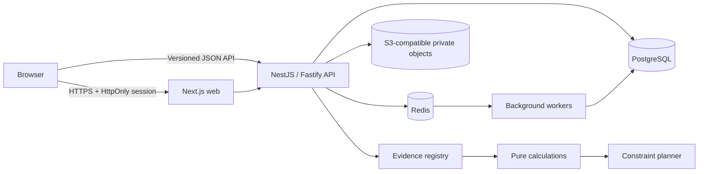

# Architecture overview

Be Human starts as a modular monolith plus independently deployable web and worker boundaries. This keeps policy and transactions coherent while leaving seams for later extraction.

The browser never decides authorization. The API resolves identity, relationship context, resource ownership, granular sharing, professional restrictions, standards applicability, and evidence provenance. Pure packages contain deterministic calculations and planning so they can be tested without framework or database state.

Absolute events are stored as `timestamptz`; user and event time zones are stored separately. Historical context, standards, and calculated output are versioned rather than overwritten.

## Trust boundaries

Browser input, uploads, connected calendars, retrieved documents, AI output, and environmental providers are untrusted. The database is sensitive. AI is permitted to explain or summarize only vetted results; it cannot create evidence records, override a hard constraint, or authorize a resource.
